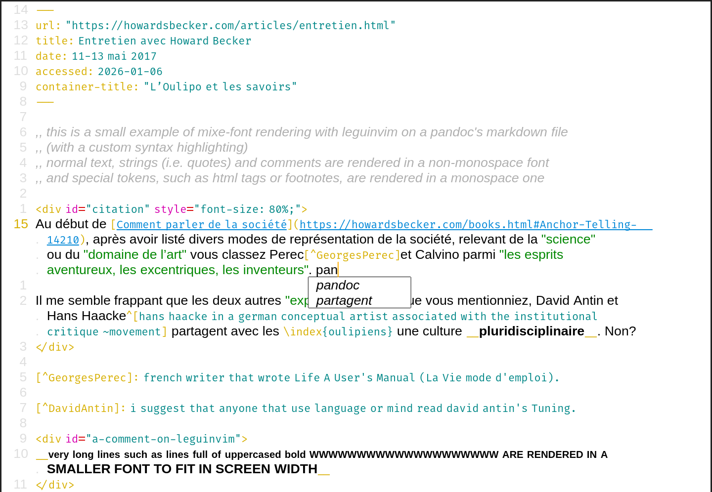

__leguinvim__ - neovim gui with non-monospace font support.

For people who want to use neovim for prose writing: SF novel, master thesis...

May look awful with some plugins. still very buggy.
If you want to try it anyway, check how to [install](#install) and [configure](#configure) it.

The name is a reference to SF writer [Ursula K. Le Guin](https://de.wikipedia.org/wiki/Ursula_K._Le_Guin): neovim makes possible to [edit text at the speed of thought](https://archive.org/details/practical-vim-edit-text-at-the-speed-of-thought), just as fast as Le Guin's characters with their telepathy abilities and their [ansibles](https://en.wikipedia.org/wiki/Ansible).
The project could thus have been named *gtkleguinvim* (because it uses [gtk](https://www.gtk.org/)). But it's too long.

## mixed fonts

__leguinvim__ can render both monospace and non-monospace fonts in the same window. For example, you can use a non-monospace font for text and a monospace font for latex macros. (See [configuration](#configure).)




## install

```bash
# download linux binary (other platforms binaries will come soons!)
wget https://github.com/thjbdvlt/leguinvim/releases/latest/download/leguinvim
cp leguinvim ~/.local/bin/ # or wherever you want to install it

# or build (requires cargo)
git clone https://github.com/thjbdvlt/leguinvim leguinvim
cd leguinvim
make install
```

## configure

To configure __leguinvim__, use a `ginit.vim` file in your neovim configuration directory:

```vim
" e.g. ~/.config/nvim/ginit.vim

" main font
call rpcnotify(1, 'Gui', 'Font', 'Liberation Sans 12') " default

" monospace font used for floating windows
call rpcnotify(1, 'Gui', 'AltFont', 'Fira Code 12') " default

" use monospace font for floating windows. 0 or 1 (default)
call rpcnotify(1, 'Gui', 'FloatAltFont', 1)
```

## how it works

The rendering of non-monospace font by __leguinvim__ is a quick and dirty (and ultra-lazy) solution, and kind of a hacky one: __leguinvim__ doesn't try to wrap the lines by itself, it just lets neovim do it by character count.

Some lines can thus be very long, and some other very short??? Yes. But when writing prose, at least for some languages, and maybe surprisingly, it actually just works, because lines naturally tend to be a mix of narrow, wide and medium-width letters.
Except for extreme edge-cases, like lines full of bold-uppercase __W__. For these cases, __leguinvim__ reduce the font size for the line, to keep the whole text visible:


## source

__leguinvim__ is forked from [neovim-gtk](https://github.com/lyude/neovim-gtk).
(lot of removals and changes.)

## todo

This project aims to stay simple. No funky widgets nor smooth scrolling. Just non-monospace fonts: that's still a lot to improves, lot of bugs to fix, of workarounds to find!
