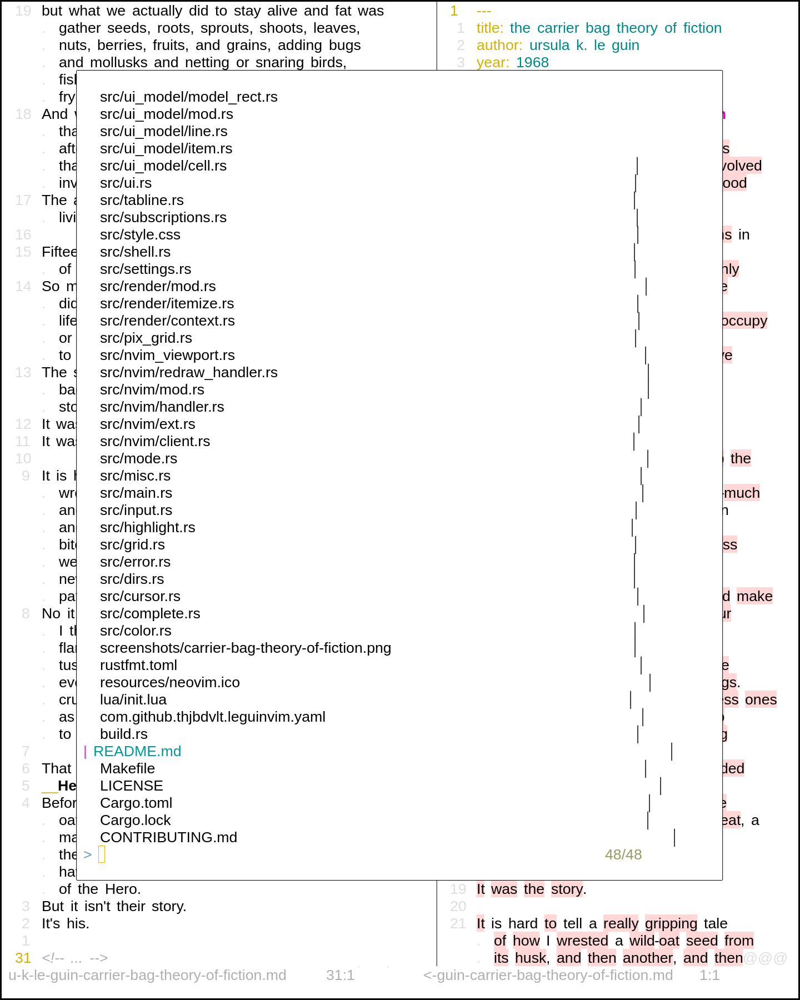

__leguinvim__ - neovim gui with non-monospace font support.

for people who want to use neovim for prose writing: sf novel, master thesis...

may look awful with some plugins. still very buggy.

forked from [neovim-gtk](https://github.com/lyude/neovim-gtk).
(lot of removals and changes.)

```bash
# download linux binary (other platforms binaries will come soons!)
wget https://github.com/thjbdvlt/leguinvim/releases/download/0.0.3/leguinvim

# or build (requires cargo)
git clone https://github.com/thjbdvlt/leguinvim leguinvim
cd leguinvim
make install
```

the name is a reference to sf writer [ursula k le guin](https://de.wikipedia.org/wiki/Ursula_K._Le_Guin): neovim makes possible to edit text at the speed of thought, just as fast as le guin's characters with their telepathy abilities and their ansibles.
the project could thus have been named *gtkleguinvim*. but it's too long.





to configure __leguinvim__, you may:

```vim
" ~/.config/nvim/ginit.vim
call rpcnotify(1, 'Gui', 'Font', 'Liberation Sans 20')  " main font
call rpcnotify(1, 'Gui', 'FontMono', 'Fira Code 16')  " monospace font (floating windows)
```
